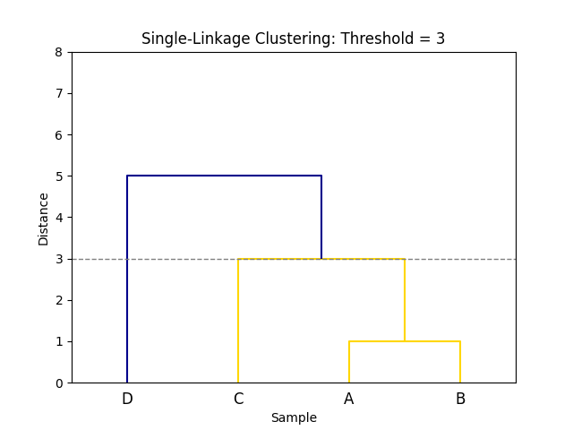

# Overview

## Introduction

The Genomic Address Service (GAS) has two major components: **mcluster** and **call**. Additionally, the GAS workflow may be supported by **profile_dists**. Although the specifics can change, the GAS workflow commonly has the following steps:

1. [**profile_dists**](#profile_dists-generating-a-distance-matrix) (initial samples): generate distances between all samples
2. [**mcluster**](#mcluster-generating-cluster-addresses): generate a completely new clustering from distances
3. [**profile_dists**](#profile_dists-generating-pairwise-distances-for-new-samples) (new samples): generate distances between new samples and existing samples
4. [**call**](#call-clustering-new-samples): update an existing clustering (generated by mcluster) with new samples

This overview document builds on knowledge in each step, so it may be easier to follow if the sections are read in order.

## profile_dists: Generating a Distance Matrix

[profile_dists](https://github.com/phac-nml/profile_dists) generates pairwise distances from categorical input vectors. Although profile_dists can calculate distances from any kind of categorical vectors, it is common to use vectors that represent gene variants.

### Context

Let's say there are eight genes of interest. Each of these genes may have different variants (i.e. alleles). In this example, "variant" refers to the whole gene and not specific single nucleotide variants within that gene. We can assign each gene variant its own categorical label (ex: `1`, `2`, `3`, etc.) and create a vector for each sample that shows which gene variants are present in the sample.

For example:

```
id   g1   g2   g3   g4   g5   g6   g7   g8
A    1    2    2    3    1    1    1    1
```

is a vector representing sample `A` with eight components (one for each gene). We can see that sample `A` has gene variant `1` for the first gene (`g1`), gene variant `2` for the second gene (`g2`), and gene variant `3` for the fourth gene (`g4`).

We can represent multiple samples in this way:

```
id   g1   g2   g3   g4   g5   g6   g7   g8
A    1    2    2    3    1    1    1    1
B    2    2    2    3    1    1    1    1
C    1    2    2    2    1    1    3    2
D    2    3    1    2    2    2    3    2
```

### Hamming Distances

We can take the above TSV-formatted categorical vector file as input and calculate the distance between each sample (vector) pair (i.e. pairwise distances). We first show an example using *Hamming distances*.

Consider samples (vectors) `A` and `B`:

```
id   g1   g2   g3   g4   g5   g6   g7   g8
A    1    2    2    3    1    1    1    1
B    2    2    2    3    1    1    1    1
```

A Hamming distance measure defines distance as the number of vector components that are different between two vectors, which is equivalent to the number of genes that have different variants. Sample `A` and `B` differ only in the first vector component (`g1`: the first gene), so the Hamming distance between them is `d(A, B) = 1`.

The pairwise Hamming distances between all vectors can likewise be calculated:

```
id   g1   g2   g3   g4   g5   g6   g7   g8
A    1    2    2    3    1    1    1    1
B    2    2    2    3    1    1    1    1
C    1    2    2    2    1    1    3    2
D    2    3    1    2    2    2    3    2
```

- `d(A, C) = 3`: `g4`, `g7`, and `g8` are different
- `d(A, D) = 8`: `g1`, `g2`, `g3`, `g4`, `g5`, `g6`, `g7`, and `g8` (i.e all) are different
- `d(B, C) = 4`: `g1`, `g4`, `g7`, and `g8` are different

profile_dists performs the operation of calculating the pairwise distances between all categorical vectors with a command similar to following:

```
profile_dists --query input.tsv --ref input.tsv --outdir output --distm hamming
```

and we can view the full distance matrix constructed by profile_dists from these individual pairwise distance calculations:

```
cat output/results.text
```

```
dists   A       B       C       D
A       0       1       3       8
B       1       0       4       7
C       3       4       0       5
D       8       7       5       0
```

This distance matrix matches what we calculated above:

- `d(A, B) = 1`: there is `1` gene that differs between `A` and `B`
- `d(A, C) = 3`: there are `3` genes that differ between `A` and `C`
- `d(A, D) = 8`: there are `8` genes that differ between `A` and `D`
- `d(B, C) = 4`: there are `4` genes that differ between `B` and `C`

### Scaled Distances

profile_dists also provides the option of calculating *scaled distances*. The distance calculation for scaled distances is the same as Hamming distances, except they are divided by the number of vector components and range from `0` to `100.0` (i.e. 0% different to 100% different).

Consider samples (vectors) `A` and `B`:

```
id   g1   g2   g3   g4   g5   g6   g7   g8
A    1    2    2    3    1    1    1    1
B    2    2    2    3    1    1    1    1
```

The Hamming distance between `A` and `B` is `1`, as they differ only in the first gene (`g1`). However, we need to scale this Hamming distance by the number of vector components (`8`). The scaled distance between `A` and `B` is therefore:

`d(A,B) = Hamming(A,B) / components = 1/8 = 12.5%`

The pairwise scaled distances between all vectors can likewise be calculated:

```
id   g1   g2   g3   g4   g5   g6   g7   g8
A    1    2    2    3    1    1    1    1
B    2    2    2    3    1    1    1    1
C    1    2    2    2    1    1    3    2
D    2    3    1    2    2    2    3    2
```

- `d(A,C) = 37.5`: `Hamming(A,C) = 3` -> `3/8 = 37.5%`
- `d(A,D) = 100.0`: `Hamming(A,D) = 3` -> `8/8 = 100.0%`
- `d(B,C) = 50.0`: `Hamming(B,C) = 3` -> `4/8 = 50.0%`

profile_dists calculates these distances with a command similar to following:

```
profile_dists --query input.tsv --ref input.tsv --outdir output --distm scaled
```

and we can view the full distance matrix constructed by profile_dists from these individual pairwise distance calculations:

```
cat output/results.text
```

```
dists   A       B       C       D
A       0.0     12.5    37.5    100.0
B       12.5    0.0     50.0    87.5
C       37.5    50.0    0.0     62.5
D       100.0   87.5    62.5    0.0
```

### Summary

[profile_dists](https://github.com/phac-nml/profile_dists) calculates pairwise distances between categorical vectors, which will often represent the number of gene variants that are different between samples. These distances may be Hamming, which represents the number of vector components (often genes) that are different, or scaled, which represents the percentage of vector components (often genes) that are different.

## mcluster: Generating Cluster Addresses

[GAS mcluster](https://github.com/phac-nml/genomic_address_service/) (multi-level clustering) generates multiple flat cluster addresses (ex: `1`, `2`, `3`) from a distance matrix of distances between all samples and combines them into a single flat cluster address separated by delimiters (ex: `1.2.3`).

### Cluster Addresses

In order to explain GAS mcluster, it is helpful to first explain the nature of cluster addresses. GAS addresses are usually defined by multiple distance thresholds (ex: `5,3,0`), such that each distance threshold defines the maximum distance cluster members may be from each other and still be in the same cluster. In this way, each threshold corresponds to a different component of the cluster address:

|                    | Component 1 | Component 2 | Component 3 |
| ------------------ | ----------- | ----------- | ----------- |
| Treshold           | 5           | 3           | 0           |
| Sample A Address   | 1           | 1           | 1           |
| Sample D Address   | 2           | 3           | 4           |

These three thresholds (`5,3,0`) would generate addresses that have three components and look similar to Sample `A`: `1.1.1` and Sample `B`: `2.3.4`. The integers that comprise each part of the cluster address are *labels*, meaning that something labelled `1` isn't necessarily closer to something labelled `2` than something labelled `3`.

In this example, the first threshold (`5`) defines the maximum distance for the first part of the cluster address ("Component 1"). Cluster assignments for this part of the address will be such that the maximum distance of samples within each cluster from each other is no more than `5` (when performing complete-linkage clustering). So when Sample `A` is assigned cluster label `1` for the first threshold component, we know that Sample `A` is within `5` (complete-linkage) distance from all other samples in cluster `1`. However, note that the distance between samples and clusters depends on the type of linkage clustering method used: *simple*, *average*, or *complete*. These linkage methods are explained in more detail later.

Although we can use different kinds of distance measurement and linkage clustering methods, for this example, we continue to use the same data and distance measurements generated within the [profile_dists section above](#profile_dists-generating-a-distance-matrix).

### Hierarchical Clustering

Although each part of the cluster address is defined by its corresponding threshold, every part of the address is a different flat clustering of the same hierarchical clustering (linkage) using different distance thresholds.

Hierarchical clustering operates on a distance matrix and works by finding and joining the two closest clusters, updating distances between clusters, and repeating these steps until everything is hierarchically clustered. The main difference between the linkage clustering methods used by mcluster is how distances are updated after merging clusters into a new hierarchical clustering.

### Complete-Linkage Clustering

The following is the distance matrix generated in the [profile_dists section above](#hamming-distances). The distances here represent the Hamming distances between categorical vectors. In effect, this matrix shows the number of gene variant differences (i.e. alleles) between samples.

```
dists   A       B       C       D
A       0       1       3       8
B       1       0       4       7
C       3       4       0       5
D       8       7       5       0
```

As a quick review:

- `d(A,B) = 1`: there is `1` gene that differs between `A` and `B`
- `d(A,C) = 3`: there are `3` genes that differ between `A` and `C`

Functionally, there is a step that converts this 2-dimensional distance matrix into an equivalent 1-dimensional vector that represents the top-right corner of the original distance matrix. This transformation isn't necessary to understand the rest of the linkage algorithm, but it's included for completeness:

```
[1, 3, 8, 4, 7, 5]
```

The first step in generating the linkage is identifying the closest two clusters in the input distance matrix. We initially consider each element of the matrix to be a cluster with one element (itself). We find that the smallest distance in the distance matrix is `d(A,B) = 1`. So we create a cluster that contains `A` and `B` and update the distances between this newly created cluster and every other cluster.


We then need to calculate the new distances between cluster `(A,B)` and `(C)`, and `(A,B)` and `(D)`. Since we're using a complete-linkage clustering method, the distance is defined as the maximum distance between comprising clusters and the other clusters. For example:

```
d((A,B), C) = MAX(d(A,C), d(B,C))
```

In effect, the distance between the new cluster `(A,B)` and `(C)` is the greater of the distance between `(A)` and `(C)`, or `(B)` and `(C)`.

```
d((A,B),C) = MAX(d(A,C), d(B,C))
d((A,B),C) = MAX(3,4)
d((A,B),C) = 4
```

We can similarly determine the distance between the new cluster `(A,B)` and `(D)`:

```
d((A,B),D) = MAX(d(A,D), d(B,D))
d((A,B),D) = MAX(8,7)
d((A,B),D) = 8
```

We then update the distance matrix with the new distances:

```
dists   (A,B)   C       D
(A,B)   0       4       8
C       4       0       5
D       8       5       0
```

We then repeat the algorithm until only a single cluster remains. We can see that the next smallest distance in the matrix is `d((A,B),C) = 4`, so we create a new cluster `((A,B),C)` and update the distance matrix:

```
d(((A,B),C),D) = MAX(d((A,B),D), d(C,D))
d(((A,B),C),D) = MAX(8, 5)
d(((A,B),C),D) = 8
```

```
dists        ((A,B),C)    D
((A,B),C)    0            8
D            8            0
```


Lastly, the next (and only remaining) smallest distance is `d(((A,B),C),D) = 8`, so we cluster those and then we've completed a hierarchical clustering using a complete-linkage clustering method:


The height of the above dendrogram (the y-axis labelled "Distance") tells us the greatest distance between samples within a clustering. For example, the node of `(C,(A,B))` has a height of `4`, which tells us that the `(C,(A,B))` cluster has a distance of `4`. This can have different meanings depending on the linkage method used to generate the linkage. Since we used a complete-linkage method to generate the linkage for this dendrogram, this tells us that the maximum distance between any two elements of the cluster is `4`. Further, since our distances are derived from the Hamming distance between categorical vectors of gene variants, this specifically tells us that within the `(C,(A,B))` cluster, no two samples have more than `4` gene variant (i.e. allele) differences between them.

### Complete-Linkage Data Object

GAS's mcluster uses SciPy's `scipy.cluster.hierarchy.linkage` function to generate a linkage object, which represents the hierarchical clustering performed in the previous step.

```
[[0. 1. 1. 2.]
 [2. 4. 4. 3.]
 [3. 5. 8. 4.]]
```

The above linkage has the following structure:

|           | Cluster Index 1 | Cluster Index 2 | Distance | Number of Elements |
| --------- | --------------- | --------------- | -------- | ------------------ |
| Cluster 1 | 0               | 1               | 1        | 2                  |
| Cluster 2 | 2               | 4               | 4        | 3                  |
| Cluster 3 | 3               | 5               | 8        | 4                  |

Each row represents a cluster in the hierarchical cluster. *Cluster Index 1* and *Cluster Index 2* refer to the index of the clusters that make up the cluster. For example, for Cluster 1, index `0` refers to cluster `A` and index `1` refers to cluster `B`, meaning the row represents the `(A,B)` cluster. This is explained in detail more below. *Distance* represents the distance of elements within clusters, which can have different meanings depending on the linkage method used. *Number of Elements* represents the number of the number of elements (input samples) within the cluster.

There are a number of implied clusters that are not shown in the linkage, but are implicitly referenced by the linkage. These are clusters with only one element: the original inputs. The linkage can be expanded to improve clarity:

```
[[0. 0. 0. 1.]
 [1. 1. 0. 1.]
 [2. 2. 0. 1.]
 [3. 3. 0. 1.]
 [0. 1. 1. 2.]
 [2. 4. 4. 3.]
 [3. 5. 8. 4.]]
```

Where the first 4 rows have been added for illustrative purposes and represent clusters of size one comprised of the input samples. This illustrative linkage can then be understood as follows:

| Index     | Cluster Index 1 | Cluster Index 2 | Distance | Number of Elements | Representation |
| --------- | --------------- | --------------- | -------- | ------------------ | -------------- |
| 0         | 0               | 0               | 0        | 1                  | (A)            |
| 1         | 1               | 1               | 0        | 1                  | (B)            |
| 2         | 2               | 2               | 0        | 1                  | (C)            |
| 3         | 3               | 3               | 0        | 1                  | (D)            |
| 4         | 0               | 1               | 1        | 2                  | (A,B)          |
| 5         | 2               | 4               | 4        | 3                  | (C,(A,B))      |
| 6         | 3               | 5               | 8        | 4                  | (D,(C,(A,B)))  |

- Index `0` represents a cluster containing clusters with indices `0` and `0`. It has a distance of `0` and contains `1` element. It represents the cluster: `(A)`.
- Index `1` represents a cluster containing clusters with indices `1` and `1`. It has a distance of `0` and contains `1` element. It represents the cluster: `(B)`.
- Index `4` represents a cluster containing clusters with indices `0` and `1`. It has a distance of `1` and contains `2` elements. It represents the cluster: `(A,B)`.
- Index `5` represents a cluster containing clusters with indices `2` and `4`. It has a distance of `4` and contains `3` elements. It represents the cluster: `(C,(A,B))`.
- Index `6` represents a cluster containing clusters with indices `3` and `5`. It has a distance of `8` and contains `4` elements. It represents the cluster: `(D,(C,(A,B)))`.

We can see that the hierarchical clustering generated by this linkage `(D,(C,(A,B)))` matches the clustering we generated manually in the previous section `(((A,B),C),D)`. The ordering is reversed, but the clustering and meaning is the same.

### Generating an Address from the Complete-Linkage Hierarchical Clustering

Once the hierarchical clustering (i.e. linkage) is generated, we can generate flat clusters by choosing a distance threshold, traversing the hierarchical cluster until we find a cluster with a distance that meets our threshold, assigning everything within it to the same flat cluster with the same flat cluster label, and repeating this process until everything in the hierarchical cluster has been flat clustered with a label.

We repeat this process for each threshold, which will use a different distance each time, but use the same hierarchical clustering for each threshold. Each threshold will generate a label and we join the labels together with a delimiter (ex: `.`) to create a flat cluster address.

For example, if our thresholds are `5,3,0`, we start with the first threshold (`5`) and traverse the linkage (the linkage table above) from the root until we find a node where the distance is no more than our threshold. The root is the last element in the linkage (index `6`).

- Index `6` contains `A,B,C,D` and has a distance of `8`, which is greater than our threshold (`5`), so we cannot create one flat cluster with everything. We then look at the two children of this node: index `3` and `5`.
- Index `3` contains `D` and has a distance of `0` (within its own cluster), which is less than the threshold (`5`), so `D` will become its own flat cluster and we stop traversing this path.
- Index `5` contains `A,B,C` and has a distance of `4`, which is less than the threshold (`5`), so `A,B,C` will become a flat cluster and we stop traversing this path.


Since there are no more paths to traverse (everything has been flat clustered), we assign integer labels to the flat clusters: `A,B,C` are assigned cluster label `1` and `D` is assigned cluster label `2`. We now have the following flat cluster labels:

```
id      address   thresh=5   thresh=3   thresh=0
A       1         1
B       1         1
C       1         1
D       2         2
```

We repeat this process for the next threshold (`3`):

- Index `6` contains `A,B,C,D` and has a distance of `8`, which is greater than our threshold (`3`), so we check the child nodes: index `3` and `5`.
- Index `3` is `D` and has a distance of `0`, so it becomes a flat cluster.
- Index `5` contains `A,B,C` and has a distance of `4`, which is larger than our threshold (`3`), so we check its child nodes: index `2` and `4`.
- Index `2` contains `C` and has a distance of `0`, so it becomes a flat cluster.
- Index `4` contains `A,B` and has a distance of `2`, which is less than the threshold (`3`), so it becomes a flat cluster.


We have assigned a flat cluster to all elements: `(A,B)`, `(C)`, and `(D)`. We then assign the flat clusters integer labels:
- `(A,B) -> 1`
- `(C) -> 2`
- `(D) -> 3`

We now have the following flat cluster labels:

```
id      address   thresh=5   thresh=3   thresh=0
A       1.1       1          1
B       1.1       1          1
C       1.2       1          2
D       2.3       2          3
```

The same process is repeated for the final threshold (`0`). The above flat cluster process is performed as described, but functionally a threshold of `0` creates flat clusters where elements only cluster together if they are identical (for our data this happens when all their gene variants / alleles match exactly):

```
id      address   thresh=5   thresh=3   thresh=0
A       1.1       1          1          1
B       1.1       1          1          2
C       1.2       1          2          3
D       2.3       2          3          4
```


This matches the output produced by `gas mcluster` when provided the same data:

```
gas mcluster -t 5,3,0 -i distance_matrix.tsv -o output --method complete
```

```
cat output/clusters.text
```

```
id      address level_1 level_2 level_3
A       1.1.1   1       1       1
B       1.1.2   1       1       2
C       1.2.3   1       2       3
D       2.3.4   2       3       4
```

### Single-Linkage Clustering

The [above example](#complete-linkage-clustering) demonstrated creating a hierarchical clustering (linkage) using complete-linkage clustering. *Complete-linkage* clustering distances for merged hierarchical clusters are calculated as the *maximum* distance between each of the two comprising clusters in a merged cluster and another cluster:

Let `(X,Y)` be a newly merged hierarchical cluster constain clusters `X` and `Y`. The complete-linkage distance between `(X,Y)` and another cluster `Z` is defined as follows:

```
d((X,Y),Z) = MAX(d(X,Z), d(Y,Z))
```

In contrast, *single-linkage* clustering distances for merged hierarchical clusters are calculated as the *minimum* distance between each of the two comprising clusters in a merged cluster and another cluster:

```
d((X,Y),Z) = MIN(d(X,Z), d(Y,Z))
```

For example, using the same distance matrix as before:

```
dists   A       B       C       D
A       0       1       3       8
B       1       0       4       7
C       3       4       0       5
D       8       7       5       0
```

`A` and `B` will cluster together since they are the closest (`d(A,B)=1`).


The distance between `(A,B)` and `C`, and `(A,B)` and `D` needs to be calculated. With *single-linkage* clustering, this is the minimum distance:

```
d((A,B),C) = MIN(d(A,C), d(B,C))
```

In effect, the distance between the new cluster `(A,B)` and `(C)` is the smaller of the distance between `(A)` and `(C)`, or `(B)` and `(C)`.

```
d((A,B),C) = MIN(d(A,C), d(B,C))
d((A,B),C) = MIN(3,4)
d((A,B),C) = 3
```

We can similarly determine the distance between the new cluster `(A,B)` and `(D)`:

```
d((A,B),D) = MIN(d(A,D), d(B,D))
d((A,B),D) = MIN(8,7)
d((A,B),D) = 7
```

We then update the distance matrix with the new distances:

```
dists   (A,B)   C       D
(A,B)   0       3       7
C       3       0       5
D       7       5       0
```

We then cluster `(A,B)` with `(C)` since `d((A,B),C) = 3` is the next smallest distance in the distance matrix:


and update the distance matrix with new distances between `((A,B),C)` and every other cluster (only `D` in this case):

```
dists      ((A,B),C)   D
((A,B),C)  0           5
D          5           0
```

Finally we cluster `((A,B),C)` with `(D)` since they are the only remaining options in the distance matrix, which generates the following hierarchical clustering:


Notice that when [compared to complete-linkage clustering](#complete-linkage-clustering), although the topology for this small example is the same, the distances for each cluster are smaller.

### Generating an Address from the Single-Linkage Hierarchical Clustering

This process exactly matches the process described in the [section for generating an address from a complete-linkage hierarchical clustering](#generating-an-address-from-the-complete-linkage-hierarchical-clustering). The only difference is that the linkage topology and distances may be different. The following single-linkage is generated using `gas mcluster`:

```
[[0. 1. 1. 2.]
 [2. 4. 3. 3.]
 [3. 5. 5. 4.]]
```

Which may be interpretted as follows (including implicit clusters for clarity):

| Index     | Cluster Index 1 | Cluster Index 2 | Distance | Number of Elements | Representation |
| --------- | --------------- | --------------- | -------- | ------------------ | -------------- |
| 0         | 0               | 0               | 0        | 1                  | (A)            |
| 1         | 1               | 1               | 0        | 1                  | (B)            |
| 2         | 2               | 2               | 0        | 1                  | (C)            |
| 3         | 3               | 3               | 0        | 1                  | (D)            |
| 4         | 0               | 1               | 1        | 2                  | (A,B)          |
| 5         | 2               | 4               | 3        | 3                  | (C,(A,B))      |
| 6         | 3               | 5               | 5        | 4                  | (D,(C,(A,B)))  |

The above single-linkage may be represented as a dendrogram as follows:


When considering the first threshold of `5`, we find that all samples are contained within a hierarchical cluster with a distance no greater than `5` (index `6` in linkage table), so for this threshold, all samples will be assigned the same flat cluster with the same flat cluster label (`1`):


When considering the second threshold of `3`, we find that the `(C,(A,B))` hierarchical cluster meets the threshold requirement to form a flat cluster, so they are all labeled the same (`1`). Likewise, the `(D)` hierarchical cluster has a distance of `0`, so it assigned to a flat cluster by itself with the `2` label.



Finally, when considering the third threshold of `0`, only identical samples will flat cluster together, so in this case, every sample is assigned to its own flat cluster and given its own flat cluster label:


The above flat clustering and address generation may be automatically performed using using a single-linkage methodology with gas mcluster:

```
gas mcluster -t 5,3,0 -i distance_matrix.tsv -o output --method single
```

```
cat output/clusters.text
```

```
id      address level_1 level_2 level_3
A       1.1.1   1       1       1
B       1.1.2   1       1       2
C       1.1.3   1       1       3
D       1.2.4   1       2       4
```

### Average-Linkage Clustering

Finally, average-linkage clustering is very similar to [single-linkage](#single-linkage-clustering) and [complete-linkage](#complete-linkage-clustering) clustering, except when calculating updated distances, instead of using the minimum (single) or maximum (complete), *average-linkage clustering* uses the *average* distance.

Let `(X,Y)` be a newly merged hierarchical cluster containing clusters `X` and `Y`. The average-linkage distance between `(X,Y)` and another cluster `Z` is defined as follows:

```
d((X,Y),Z) = AVG(d(X,Z), d(Y,Z))
```

### Generating an Address from the Average-Linkage Hierarchical Clustering

The process for generating flat cluster addresses from an average-linkage hierarchical clustering is the same as for [single-](#generating-an-address-from-the-single-linkage-hierarchical-clustering) and [complete-linkage](#generating-an-address-from-the-complete-linkage-hierarchical-clustering) clustering. However, the topology and distances in the linkage may be different from the linkage methods, which may result in slightly different flat clusters and addresses.

## profile_dists: Generating Pairwise Distances for New Samples

In addition to generating a pairwise distance matrix of distances between all samples, profile_dists can be used to generate pairwise distances of new samples to already-clustered samples and organize these distances into a 3-column TSV-formatted file.

### Context

profile_dists works with categorical vectors (gene variant vectors in our examples) and the distance between vectors is informed by the Hamming distance (for both Hamming and scaled distances): the more disagreements in the vectors, the greater the distance.

We've previously [generated a square distance matrix](#profile_dists-generating-a-distance-matrix) using profile_dists. We then [generated a hierarchical clustering and linkage](#complete-linkage-clustering) from those distances and [converted hierarchical clusters into flat clusters](#generating-an-address-from-the-complete-linkage-hierarchical-clustering) using gas mcluster. We'd like to add additional samples to our flat clusters (i.e. addresses) without having to repeat the entire process from scratch with the additional samples added into the input. [gas call](#call-clustering-new-samples) allows us to update an existing cluster. However, we need pairwise distances between new samples and existing samples in the cluster so that we know how where to place the new samples.

### Generating Pairwise Distances

We've already generated flat cluster addresses for the following data:

```
id   g1   g2   g3   g4   g5   g6   g7   g8
A    1    2    2    3    1    1    1    1
B    2    2    2    3    1    1    1    1
C    1    2    2    2    1    1    3    2
D    2    3    1    2    2    2    3    2
```

profile_dists was used to generate the following (Hamming) distance matrix:

```
dists   A       B       C       D
A       0       1       3       8
B       1       0       4       7
C       3       4       0       5
D       8       7       5       0
```

and mcluster was used to generate the following (complete-linkage) flat clusters:

```
id      address level_1 level_2 level_3
A       1.1.1   1       1       1
B       1.1.2   1       1       2
C       1.2.3   1       2       3
D       2.3.4   2       3       4
```

We'd now like to assign samples `E` and `F` flat cluster addresses in a way that is consistent with the above cluster addresses:

```
id   g1   g2   g3   g4   g5   g6   g7   g8
E    1    2    3    1    1    1    2    1
F    2    2    1    1    1    1    1    3
```

We need to calculate the Hamming distance between these categorical vectors (gene variants) and the previously clustered categorical vectors. The query will contain the two new samples:

```
id   g1   g2   g3   g4   g5   g6   g7   g8
E    1    2    3    1    1    1    2    1
F    2    2    1    1    1    1    1    3
```

and the reference will contain the existing samples AND the two new samples:

```
id   g1   g2   g3   g4   g5   g6   g7   g8
A    1    2    2    3    1    1    1    1
B    2    2    2    3    1    1    1    1
C    1    2    2    2    1    1    3    2
D    2    3    1    2    2    2    3    2
E    1    2    3    1    1    1    2    1
F    2    2    1    1    1    1    1    3
```

We then calculate the Hamming distance between `E` and every reference sample:

- `d(E, A) = 3`: `g3`, `g4`, and `g7` are different
- `d(E, B) = 4`: `g1`, `g3`, `g4`, and `g7` are different
- `d(E, E) = 0`: they are the same vector so there are no differences
- `d(E, F) = 4`: `g1`, `g3`, `g7`, and `g8` are different
- etc.

As well as `F` and every reference sample:

- `d(F, A) = 4`: `g1`, `g3`, `g4`, and `g8` are different
- `d(F, B) = 3`: `g3`, `g4`, and `g8` are different
- `d(F, E) = 4`: `g1`, `g3`, `g7`, and `g8` are different
- `d(F, F) = 0`: they are the same vector so there are no differences
- etc.

profile_dists accomplishes the above with the following command:

```
profile_dists -q query.tsv -r reference.tsv --outfmt pairwise --distm hamming -o output
```

and generates the following 3-column pairwise distance output between the query and the reference:

```
query_id   ref_id  dist
E          E       0
E          A       3
E          B       4
E          C       4
E          F       4
E          D       8
F          F       0
F          B       3
F          A       4
F          E       4
F          C       5
F          D       6
```

Given our example uses categorical vectors of gene variants, this table tells us that:

- `E` has `3` allele differences with `A`
- `E` has `4` allele differences with `F`
- `F` has `6` allele differences with `D`

These distances will next be used to assign flat cluster labels (i.e. addresses) to `E` and `F` using the same context as previously assigned samples `A`, `B`, `C`, and `D`.

## call: Clustering New Samples

GAS call allows us to assign addresses to new samples within an existing flat clustering framework generated by GAS mcluster (or GAS call). GAS call preserves existing cluster addresses.

### Prerequisites

GAS call requires us to have [previously generated a flat clustering](#generating-an-address-from-the-complete-linkage-hierarchical-clustering):

```
id	address	level_1	level_2	level_3
A	1.1.1	1	1	1
B	1.1.2	1	1	2
C	1.2.3	1	2	3
D	2.3.4	2	3	4
```

and [pairwise distances](#profile_dists-generating-pairwise-distances-for-new-samples) between each new sample (`E` and `F`) and every other sample:

```
query   ref     dist
E       E       0
E       A       3
E       B       4
E       C       4
E       F       4
E       D       8
F       F       0
F       B       3
F       A       4
F       E       4
F       C       5
F       D       6
```

We are also required to know to the thresholds (`5,3,0`) that were used to generate the flat cluster addresses and the linkage method used to generate the flat cluster (complete-linkage).

### Clustering New Samples

GAS call clusters new samples by considering each query sample (`E` and `F`) individually. First, the distance between a given query sample (`E`) and every reference sample is sorted from smallest to largest:

```
query   ref     dist
E       E       0
E       A       3
E       B       4
E       C       4
E       F       4
E       D       8
```

We ignore `d(E,E)=0` as that is the distance of the query sample to itself. The next smallest distance is between `E` and `A`: `d(E,A)=3`. We then find the smallest threshold from our thresholds (`5,3,0`) that is no larger than the distance (`3`) between `E` and `A`:

|                    | Threshold 1 | Threshold 2 | Threshold 3 |
| ------------------ | ----------- | ----------- | ----------- |
| Tresholds          | 5           | 3           | 0           |
| Sample E Address   | ?           | ?           | ?           |
| Sample A Address   | 1           | 1           | 1           |

The smallest threshold no larger than the distance between `A` and `E` (`3`) is the second threshold: `3`. This tells us the maximum possible amount of overlap between `A`'s address (the closest reference) and `E`'s address (the query). Since the address of sample `A` is `1.1.1`, and the second threshold (`3`) is the smallest threshold that's still within the distance (`3`) of `A` and `E`, we know `1.1` (corresponding to the first and second thresholds) is the maximum possible amount of the address overlap possible between the two samples:

|                    | Threshold 1 | Threshold 2 | Threshold 3 |
| ------------------ | ----------- | ----------- | ----------- |
| Tresholds          | 5           | 3           | 0           |
| Sample E Address   | 1           | 1           | ?           |
| Sample A Address   | 1           | 1           | 1           |

However, even though sample `E` could form a cluster with sample `A` for both threshold 1 (`5`) and threshold 2 (`3`), and be given an address of `1.1.?`, we must still find the maximum distance between the query sample `E` and every other sample within the same flat cluster (with the same flat cluster address) at that threshold level. Starting with the smallest threshold (threshold 2: `3`), we find all samples that are assigned `1.1.?`:

```
id	address	level_1	level_2	level_3
A	1.1.1	1	1	1
B	1.1.2	1	1	2
C	1.2.3	1	2	3
D	2.3.4	2	3	4
```

Samples `A` and `B` are assigned `1.1.?`, so we check the distances between the query `E` and these samples:

```
query   ref     dist
E       A       3
E       B       4
```

We find that since the (complete-linkage) distance between the query `E` and the reference `B` (`4`) is greater than the the threshold for this level (threshold 2: `3`), we cannot assign the query `E` to `1.1`, as it will be too distant from `B`. We then try moving up the address assignment and trying again (`1.1.?` -> `1.?.?`):

```
id	address	level_1	level_2	level_3
A	1.1.1	1	1	1
B	1.1.2	1	1	2
C	1.2.3	1	2	3
D	2.3.4	2	3	4
```

We find that samples `A`, `B`, and `C` are with flat cluster `1.?.?`. The distances between these references samples and the query is as follows:

```
query   ref     dist
E       A       3
E       B       4
E       C       4
```

Since all the (complete-linkage) distances between the query and references at address `1.?.?` are less than the threshold for that level (`5`), we can assign the query the `1.?.?` address:

|                    | Threshold 1 | Threshold 2 | Threshold 3 |
| ------------------ | ----------- | ----------- | ----------- |
| Tresholds          | 5           | 3           | 0           |
| Sample A Address   | 1           | 1           | 1           |
| Sample B Address   | 1           | 1           | 2           |
| Sample C Address   | 1           | 2           | 3           |
| Sample D Address   | 2           | 3           | 4           |
| Sample E Address   | 1           | ?           | ?           |

Finally, we assign the query (`E`) the next available address at each threshold level. For the second threshold, we already have labels `1`, `2`, and `3`, so we assign the query the label `4` for that level. Similarly, for the third threshold, we already have `1`-`4`, so we assign the query `5` for that level:

|                    | Threshold 1 | Threshold 2 | Threshold 3 |
| ------------------ | ----------- | ----------- | ----------- |
| Tresholds          | 5           | 3           | 0           |
| Sample A Address   | 1           | 1           | 1           |
| Sample B Address   | 1           | 1           | 2           |
| Sample C Address   | 1           | 2           | 3           |
| Sample D Address   | 2           | 3           | 4           |
| Sample E Address   | 1           | 4           | 5           |

A similar procedure is performed for all remaining queries. This entire process is performed by GAS call with a command similar to the following:

```
gas call -t 5,3,0 -m complete -o output -d pairwise_distances.tsv -r flat_clustering.tsv
```

```
cat output/results.text
```

```
id      address
A       1.1.1
B       1.1.2
C       1.2.3
D       2.3.4
E       1.4.5
F       1.5.6
```